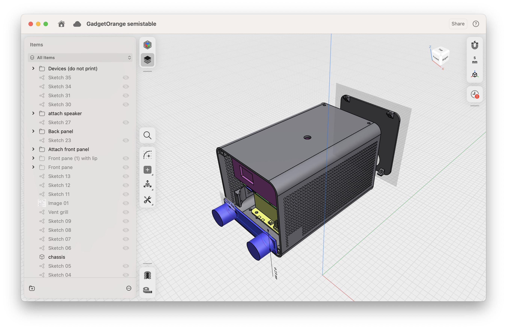
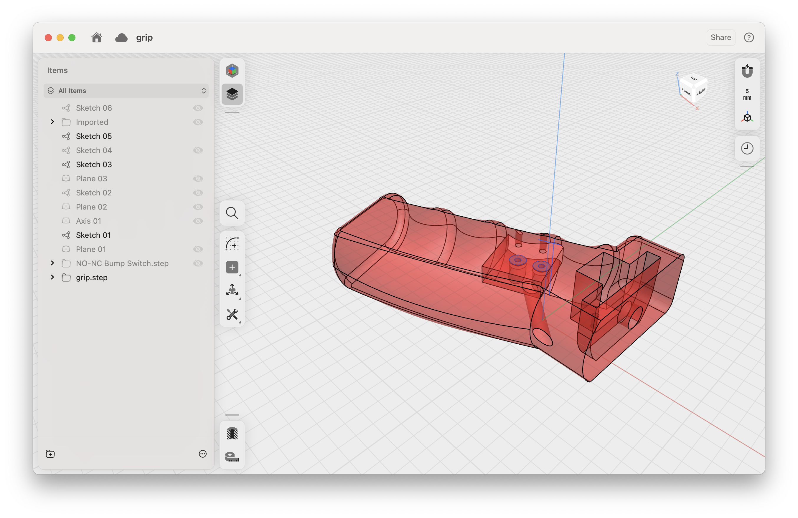

# gadget2

still very WIP; instructions may be inaccurate.





## Bill of materials

- Orange Pi 5
  - microSD card
  - [AP6275P PCIe Wi-Fi module](https://www.amazon.com/Orange-Pi-Support-Compatible-Computers/dp/B0BZRNM6HR)
- [AnyBeam mini laser projector](https://www.amazon.com/AnyBeam-Focus-free-Projection-Consumption-DisplayPort/dp/B0CZ69Q2Q4/)
- [ELP 3DGS1200P01 V83 stereo USB camera](https://www.amazon.com/dp/B0DQ4R9S6W)
- [Waveshare UPS 3S module](https://www.amazon.com/waveshare-Uninterruptible-UPS-Module-3S/dp/B0BQC2WNR8)
  - 3x 18650 lithium batteries
- [KW12-3 micro limit switch](https://www.amazon.com/dp/B07X142VGC) (trigger button)
  - 1k ohm resistor
  - trrs cable for grip trigger button
  - trrs socket to plug in trigger button
  - trrs cable for speaker
  - jumper cables

### Tools

- M2.5 driver

## Construction

1. Install Wi-Fi card in Orange Pi 5

1. Solder jumper cables to the 3.5mm socket

1. Use a soldering iron to sink the threaded inserts (1x 1/4in for
   bottom tripod, 4x M2.5 2.5mm for front panel, 4x M2.5 2.5mm for back
   panel) into the chassis / front panel

1. Glue neoprene rubber to the inside of the chassis to keep the
   projector stable

1. Attach standoffs to the Pi and battery

1. Plug GPIO pins

1. Remove the charger and power button cables from the battery and take off the rings. Attach
   the charger and power buttons to the back panel

1. Put the battery and Pi into the chassis. Bolt the battery and Pi
   standoffs in

## Software setup

```
$ sudo systemctl enable ssh && sudo systemctl start ssh
```

### Graphics

install vulkan https://github.com/Bleach665/Mali610Vulkan

### Wi-Fi

sudo apt install network-manager

/etc/netplan/50-cloud-init.yaml
```
network:
  version: 2
  ethernets:
    zz-all-en:
      match:
        name: "en*"
      optional: true
      dhcp4: true
    zz-all-eth:
      match:
        name: "eth*"
      optional: true
      dhcp4: true
  wifis:
    wlan0:
      dhcp4: true
      access-points:
        YOUR-WIFI-SSID:
          password: YOUR-WIFI-PASSWORD
```

### Folk

`sudo adduser folk i2c` for battery check

set up folk

```
folk@gadget-orange:~$ sudo gpio mode 16 up
folk@gadget-orange:~$ sudo gpio read 16
1
folk@gadget-orange:~$ sudo gpio read 16
0
folk@gadget-orange:~$ sudo gpio read 16
```


setup.folk:

```
Assert $this wishes $::thisNode uses camera "/dev/video0" with width 3200 height 1200

Assert $this wishes $::thisNode uses display 0

set fd [open |[list python3 "/home/folk/UPS_Module_3S_Code/RaspberryPi/UPS Module 3S/INA219.py"] r]
fconfigure $fd -buffering line
fileevent $fd readable [list apply {{fd} {
    if {[gets $fd line] < 0} {
        if {[eof $fd]} {
            close $fd
        }
    }

    if {[regexp {Percent:\s*([0-9\.]+)%} $line -> percent]} {
        Hold battery {Claim the battery percentage is $percent}
    }
}} $fd]

exec gpio mode 16 up

When display /disp/ has width /w/ height /h/ {
    When the clock time is /t/ {
        set pressed [expr {![exec gpio read 16]}]
        set color [expr {$pressed ? "green" : "white"}]
        Wish to draw a dashed stroke with points [list [list 0 0] [list $w 0] [list $w $h] [list 0 $h] [list 0 0]] color $color width 10 dashlength 40 dashoffset [expr {fmod($t, 10)*-120}]
    }
}

When the battery percentage is /percent/ {
    Wish to draw text with text "$percent%" x 40 y 40
}
```
