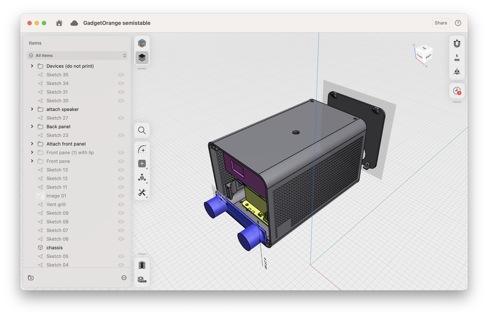
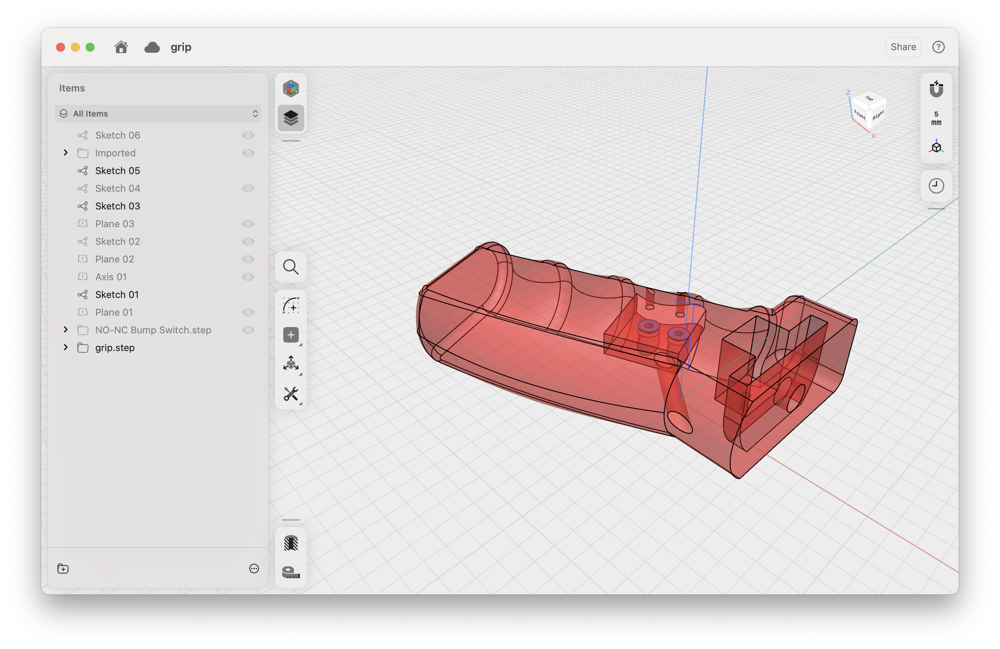
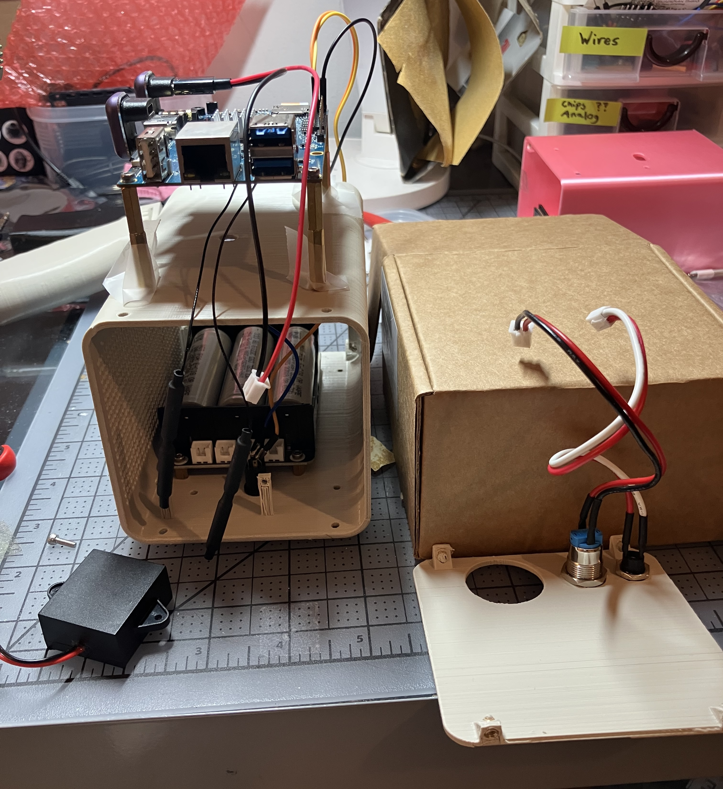
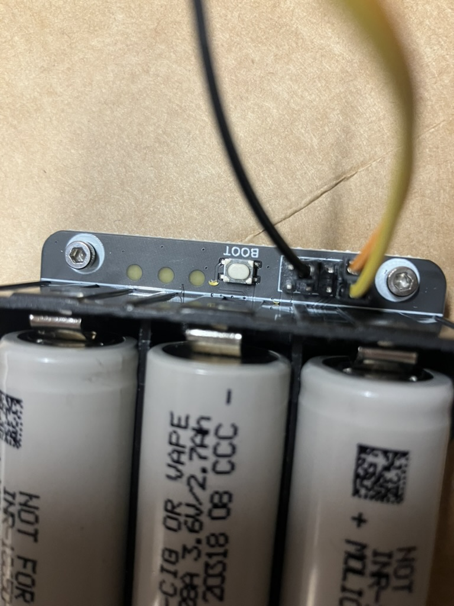
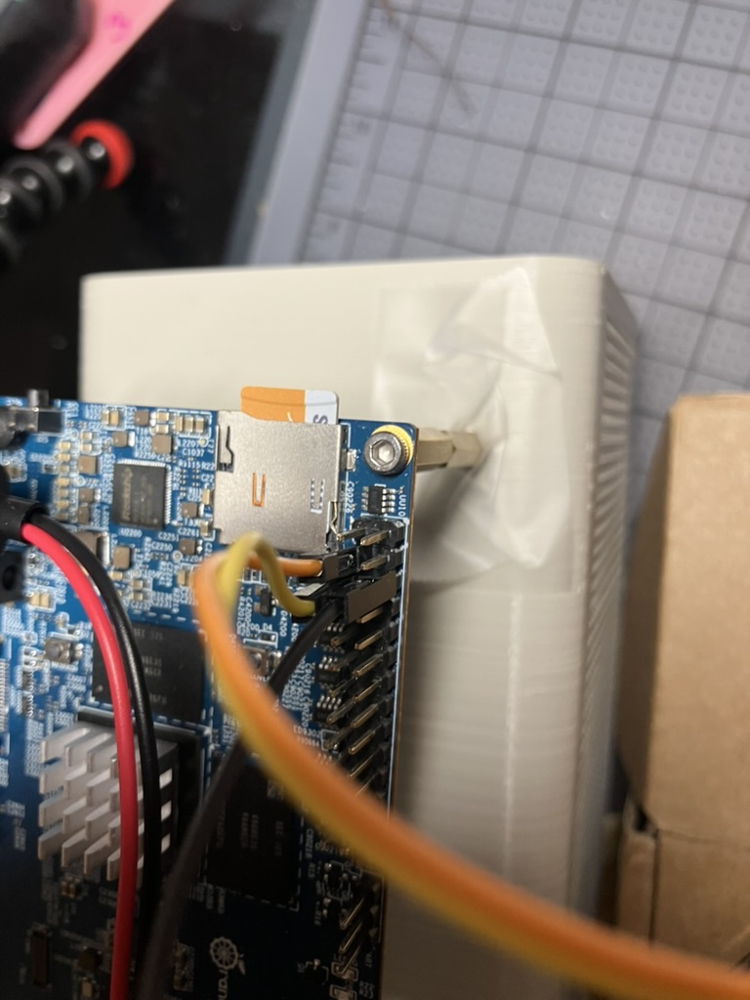
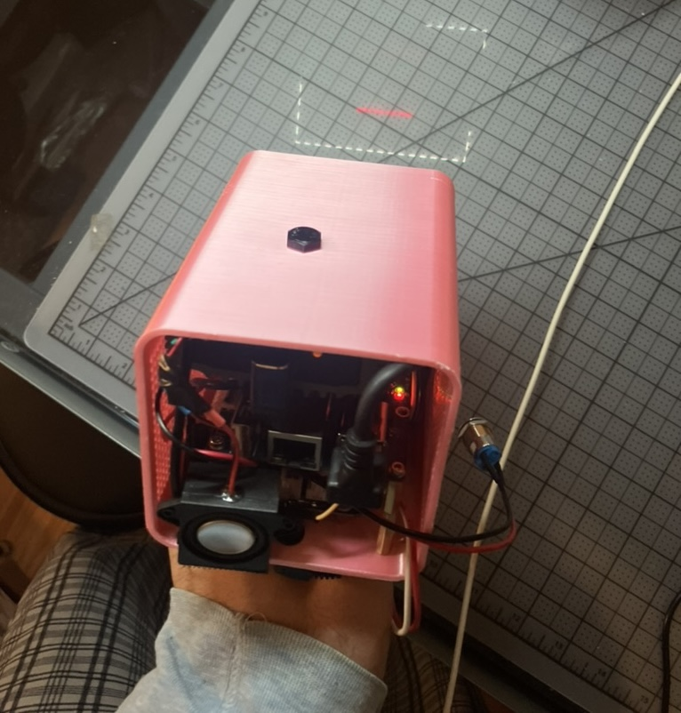
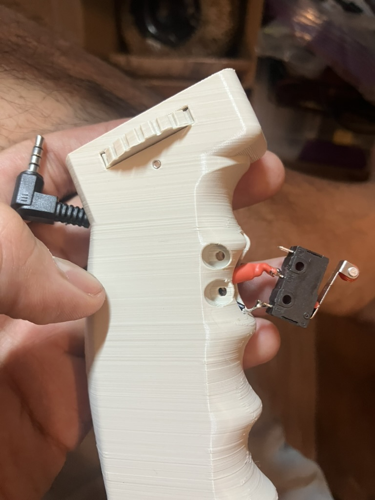

# gadget2

still very WIP; instructions may be inaccurate.





## Bill of materials

- Orange Pi 5
  - microSD card
  - [AP6275P PCIe Wi-Fi module](https://www.amazon.com/Orange-Pi-Support-Compatible-Computers/dp/B0BZRNM6HR)
- [AnyBeam mini laser projector](https://www.amazon.com/AnyBeam-Focus-free-Projection-Consumption-DisplayPort/dp/B0CZ69Q2Q4/)
- [ELP 3DGS1200P01 V83 stereo USB camera](https://www.amazon.com/dp/B0DQ4R9S6W)
- [Waveshare UPS 3S module](https://www.amazon.com/waveshare-Uninterruptible-UPS-Module-3S/dp/B0BQC2WNR8)
  - 3x 18650 lithium batteries
- [KW12-3 micro limit switch](https://www.amazon.com/dp/B07X142VGC) (trigger button)
  - 1k ohm resistor
  - [trrs cable for grip trigger button](https://www.amazon.com/dp/B085435S6G)
  - [trrs cable for speaker](https://www.amazon.com/dp/B085435S6G)
  - [trrs socket to plug in trigger button](https://www.amazon.com/dp/B089222S84)
  - jumper cables
- [M2.5 female-female standoffs](https://www.amazon.com/dp/B0BP6LT76V): 3x 35mm for Pi (you
  can combine 15mm + 20mm from that kit for these), 4x 6mm for battery
- [1/4in x 1/2in bolt and washers](https://www.amazon.com/dp/B09BLSRZ78) to hold
  projector in
  - [1/4in x 6mm (short) threaded heat set insert](https://www.amazon.com/dp/B094H2269W)
- [M2.5 threaded heat set inserts](https://www.amazon.com/dp/B0D8SV8RS3)
- M2 or M2.5 bolt to secure block into trigger grip
- [M2 bolts](https://www.amazon.com/dp/B0BXT4FG1T) to mount camera
- 2x [USB-C 240W 40Gbps 180 degree
  adapter](https://www.amazon.com/dp/B0BWDR7JMV) for USB-C power and
  USB-C video out on Pi 5
- [USB C Short Cable USB4 40Gbps
  UP-angled](https://www.amazon.com/dp/B0CM3MWY98) for projector
- [90-degree USB-C to USB-A up-angled
  cable](https://www.amazon.com/dp/B0BVYLDWMP) for camera


### Tools

- M2.5 driver

## Construction



1. Install Wi-Fi card in Orange Pi 5

1. Solder jumper cables to the 3.5mm socket

1. Use a soldering iron to sink the threaded inserts (1x 1/4in for
   bottom tripod, 4x M2.5 2.5mm for front panel, 4x M2.5 2.5mm for back
   panel) into the chassis / front panel

1. Glue neoprene rubber to the inside of the chassis to keep the
   projector stable

1. Attach standoffs to the Pi and battery.
   - Battery should be oriented with jumper pins (not the ports you plug into, the exposed pins) in
   *front* (same side as projector lens, camera). See image at top of page
   - Pi should be oriented with microSD in front

1. Connect GPIO pins on Pi to battery pins
   -  

1. Remove the charger and power button cables from the battery and take off the rings. Attach
   the charger and power buttons to the back panel

1. Put the battery and Pi into the chassis. Bolt the battery and Pi
   standoffs in

1. Screw the camera into the chassis (screws go directly into the plastic)

1. Put the projector into the chassis, bolt it in with 1/4 in bolt
   with washers both inside and outside the chassis to keep it from
   warping



### Grip construction

Print [the dial and internal block from the original grip
files](https://www.thingiverse.com/thing:1966894), and the grip file
from this repo which has a cutout for trigger button.



## Software setup

Use [Joshua Riek
Ubuntu](https://joshua-riek.github.io/ubuntu-rockchip-download/boards/orangepi-5.html).

```
$ sudo systemctl enable ssh && sudo systemctl start ssh
```

`sudo adduser folk i2c` for battery check

[Set up device tree overlays](https://github.com/Joshua-Riek/ubuntu-rockchip/wiki/Ubuntu-24.04-LTS#using-a-device-tree-overlay) -- at end of /etc/default/u-boot, for I2C
and Wi-Fi card:

```
U_BOOT_FDT_OVERLAYS="device-tree/rockchip/overlay/orangepi-5-ap6275p.dtbo device-tree/rockchip/overlay/rk3588-i2c5-m3.dtbo"
```

### Graphics

Install Vulkan: https://github.com/Bleach665/Mali610Vulkan

### Wi-Fi

sudo apt install network-manager

/etc/netplan/50-cloud-init.yaml
```
network:
  version: 2
  ethernets:
    zz-all-en:
      match:
        name: "en*"
      optional: true
      dhcp4: true
    zz-all-eth:
      match:
        name: "eth*"
      optional: true
      dhcp4: true
  wifis:
    wlan0:
      dhcp4: true
      access-points:
        YOUR-WIFI-SSID:
          password: YOUR-WIFI-PASSWORD
```

### Folk

compile wiringOP in ~/wiringOP

HACK for /dev/mem access:

    $ sudo setcap cap_sys_rawio+ep `which tclsh8.6`


For battery report: [Download "Sample demo" from Waveshare
wiki.](https://www.waveshare.com/wiki/UPS_Module_3S#Resources) Set
`i2c_bus=5` in `/home/folk/UPS_Module_3S_Code/RaspberryPi/UPS Module 3S/INA219.py` INA219 constructor.

setup.folk for folk1 (**for folk2, use this repo's setup.folk**):

```
Assert $this wishes $::thisNode uses camera "/dev/video0" with \
    width 3200 height 1200 \
    crop {x 500 y 0 width 1000 height 800}

Assert $this wishes $::thisNode uses display 0

set fd [open |[list python3 "/home/folk/UPS_Module_3S_Code/RaspberryPi/UPS Module 3S/INA219.py"] r]
fconfigure $fd -buffering line
fileevent $fd readable [list apply {{fd} {
    if {[gets $fd line] < 0} {
        if {[eof $fd]} {
            close $fd
        }
    }

    if {[regexp {Percent:\s*([0-9\.]+)%} $line -> percent]} {
        Hold battery {Claim the battery percentage is $percent}
    }
}} $fd]

When display /disp/ has width /w/ height /h/ {
    When the button is /state/ {
        When the clock time is /t/ {
            set color [expr {$state eq "pressed" ? "green" : "white"}]
            Wish to draw a dashed stroke with points \
                [list [list 0 0] \
                     [list $w 0] \
                     [list $w $h] \
                     [list 0 $h] \
                     [list 0 0]] \
                color $color width 10 dashlength 40 dashoffset [expr {fmod($t, 10)*-120}]
        }
    }
}
When the battery percentage is /percent/ {
    Wish to draw text with text "$percent%" x 40 y 40
}

set cc [c create]
$cc include <wiringPi.h>
$cc proc gpioInit {} void {
    // gpio mode 16 up
    FOLK_ENSURE(wiringPiSetup() != -1);
    pinMode(16, INPUT);
    pullUpDnControl(16, PUD_UP);
}
$cc proc gpioRead {} int {
    // gpio read 16
    return digitalRead(16);
}

c loadlib /home/folk/wiringOP/wiringPi/libwiringPi.so.2.58
$cc compile
exec sudo chmod 666 /dev/mem

gpioInit
When the clock time is /t/ {
    set pressed [expr {![gpioRead]}]
    Hold button \
        {Claim the button is [expr {$pressed ? "pressed" : "unpressed"}]}
}
```
